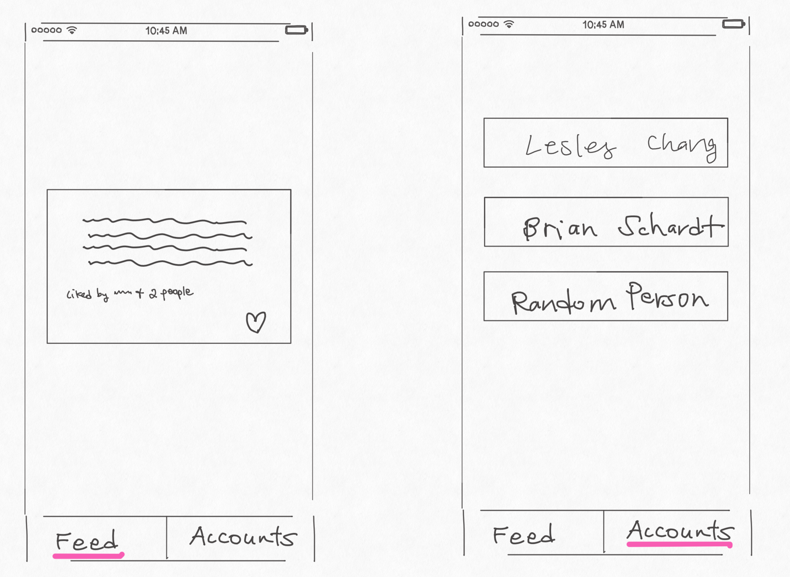

# mobx_poc

A prototype showcasing my proof of concept for Flutter MobX.

## Proof of Concept for MobX
This involves:
1. MobX
2. MobX Code Generation
3. Get for Routing

# MobX

## Main Components

### @observable

Anything susceptible to change

### @action

Operation to change an observable's state

### @computed

Similar to observables

values not directly dependent on actions

values are dependent on observable states

# Pain Points of setState

- Supposed to be used for changing the state of *internal* Widget components, meaning if you want to change the state of class A's Widget from external class B, it's really hard and unreliable
- Using setState in a larger codebase than >3 screens becomes a nightmare

## Advantages of MobX

- Rapid development because of MobX Code Generation - AKA good for bootstrapped startups
- State management across entire app is streamlined

# Example Use Case

In the Accounts screen, you can switch between your accounts (i.e. Lesley, Brian, Random). Then, navigate to Feed, and like the post as the current Account.
